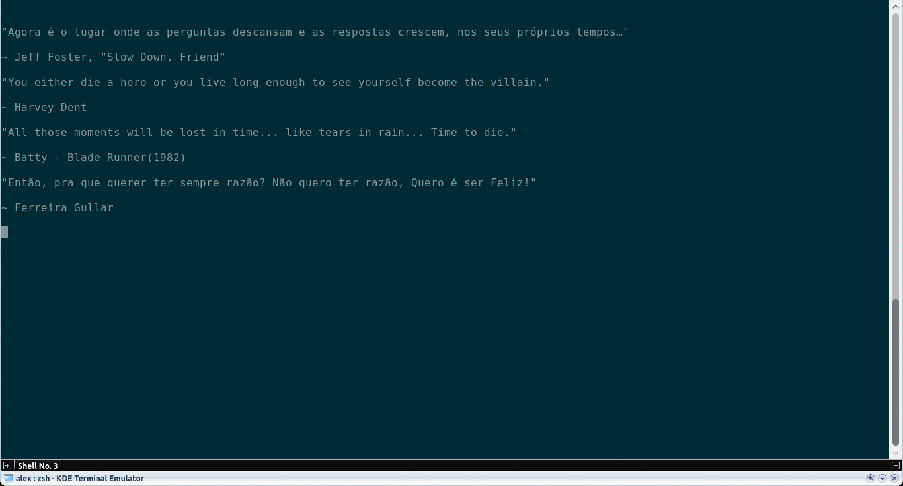
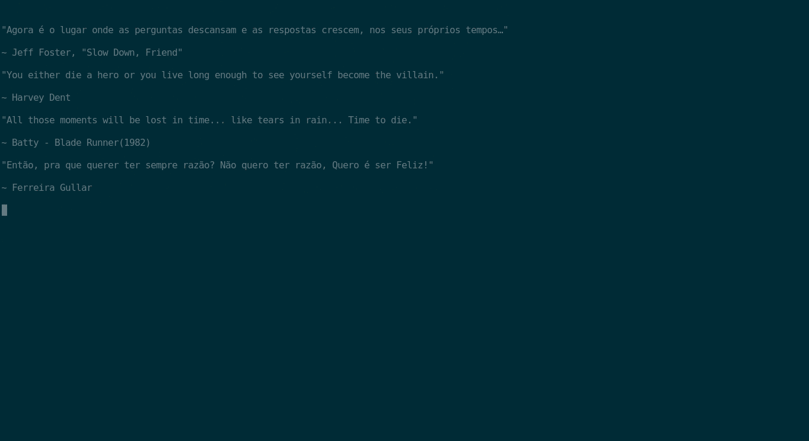

# Git Explorer

[](https://travis-ci.org/alexrochas/git-explorer)
[](https://badge.fury.io/rb/git_explorer)


GitExplorer comes from the necessity of get the status of all my local repositories. This tool will scan all your projects searching for git repositories and extract the project name, status and files unstaged.



## Installation

Linux:

```sh
~$ gem install git_explorer
```

## Usage example

Start explore with:
```bash
~$ git-explore <root_path>
```

All your git repositories from <root_path> will be scanned and the output will be similar to:
```
<project_name> is up_to_date on branch master
<project_name> is up_to_date on branch master
<project_name> is not_staged on branch master
        path/to/file
        path/to/file
        path/to/file
        path/to/file
```


## Light Explorer

In a try to add a feature to my old ls command, I've created the **light explorer** function. Will behave like a ls but if find any git repository will decorate with branch and current state.



```bash
~$ git explore --light
```

The output will decorate any directory that is also a git repository:

```bash
drwxrwxr-x  4 alex alex      4096 Jul 21 16:33 workshopvenues [master] ✖
drwxrwxr-x  2 alex alex      4096 Ago  6 01:57 zsh-ex
drwxrwxr-x  3 alex alex      4096 Nov  7 16:25 zsh-extract [master] ✔
drwxrwxr-x  3 alex alex      4096 Out  5 09:22 zsh-git-keep-autocomplete [master] ✔
drwxrwxr-x  3 alex alex      4096 Set 13 14:39 zsh-path-environment-explorer [master] ✔
drwxrwxr-x  2 alex alex      4096 Ago  6 01:23 zsh-test
drwxrwxr-x  3 alex alex      4096 Ago 12 16:57 zsh-vim-crtl-z [master] ✔
```

## Release History

* 0.1.0
    * Work in progress.

## Roadmap

* Implement more symbols to express the state of the repository (https://www.reddit.com/r/zsh/comments/2jvi61/where_can_i_find_symbol_codes_for_the_fancy/)

## Meta

Alex Rocha - [about.me](http://about.me/alex.rochas)

